# DjangoProject

Task 2 :

Hello world\!

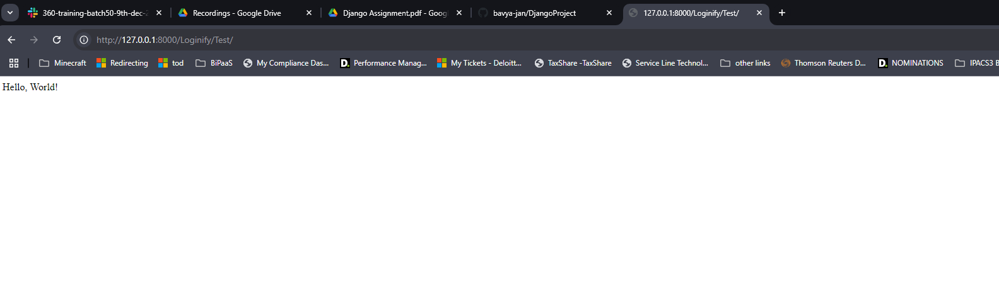

Task 3:

This is the login page

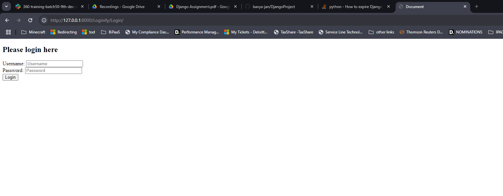

I am trying to login to user “bavya”

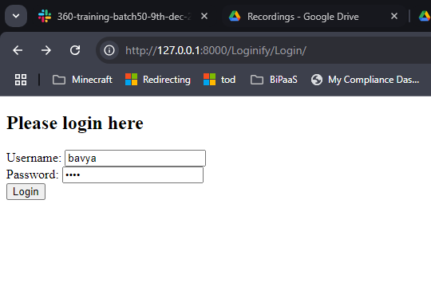

On successful login, we get login success message as below

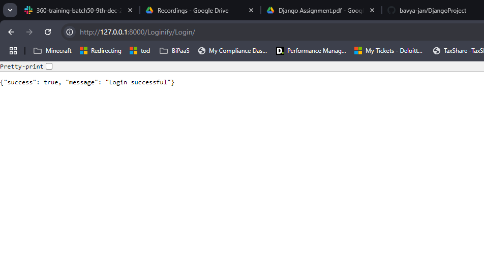

I am trying to login to user “bavya”, but I have given the incorrect password

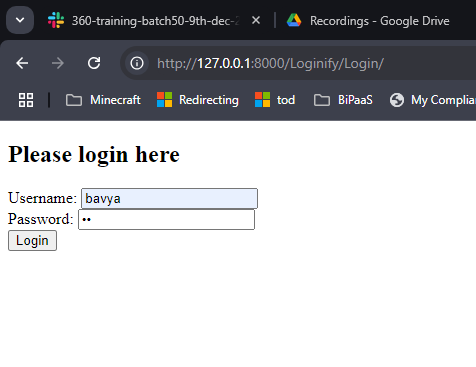

On incorrect password, we get this message 

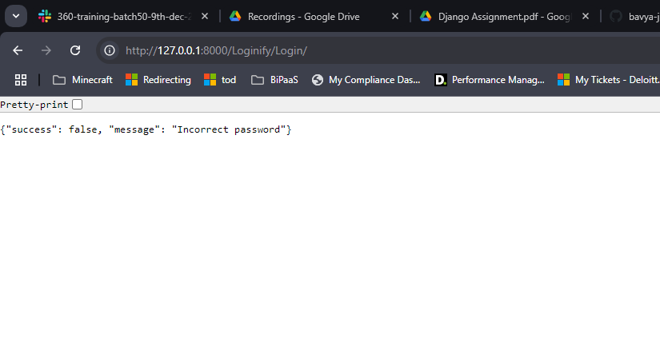

This is register form

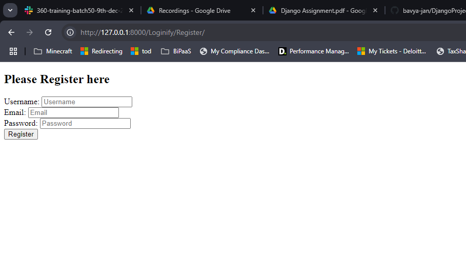

I have entered the details for user “bavya”

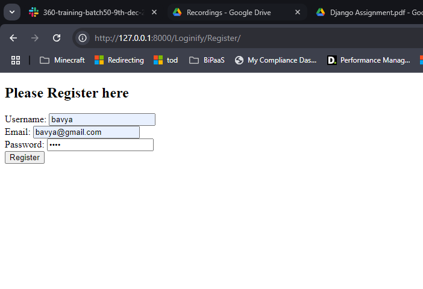

On successful registration, this will redirect to login page

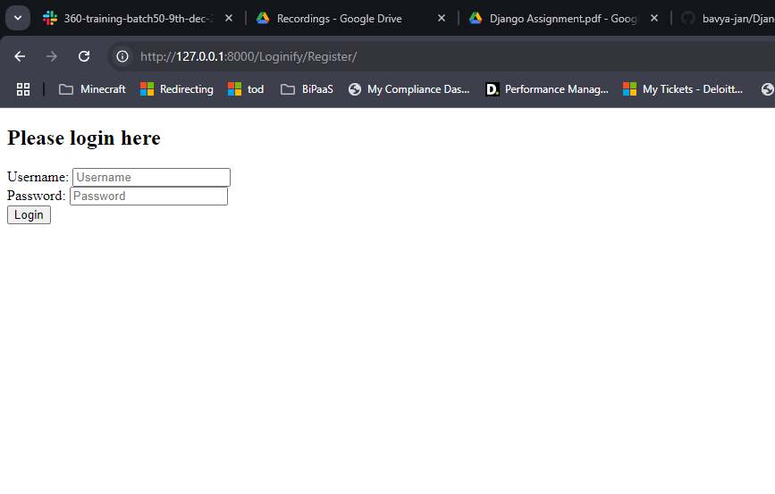

Here, I am trying to register again for user “bavya”

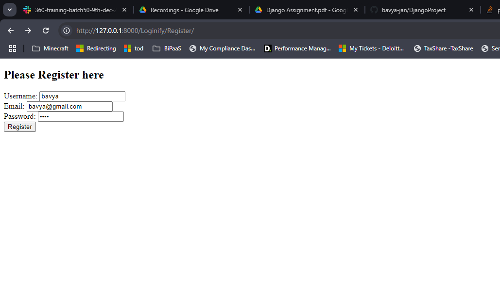

Since, the user already exists, we get this message

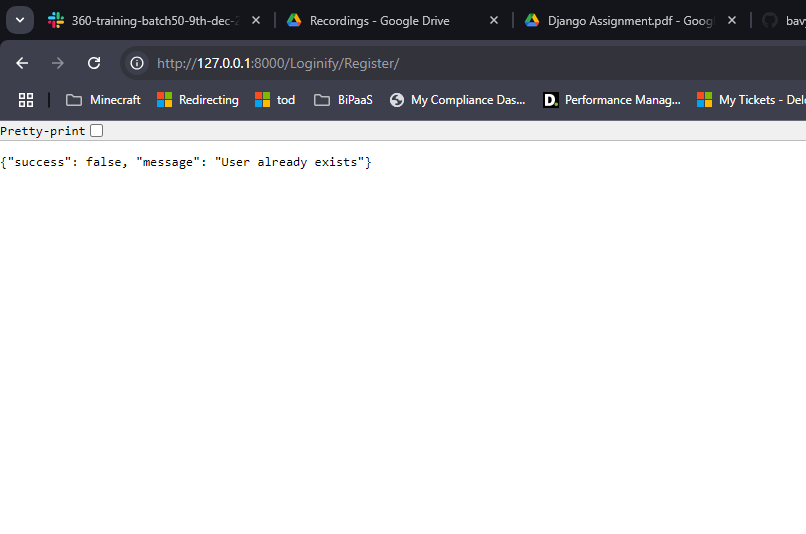

Task 4

I have created the superuser

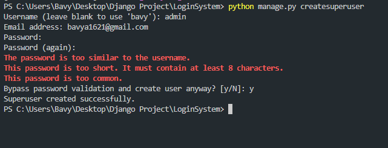

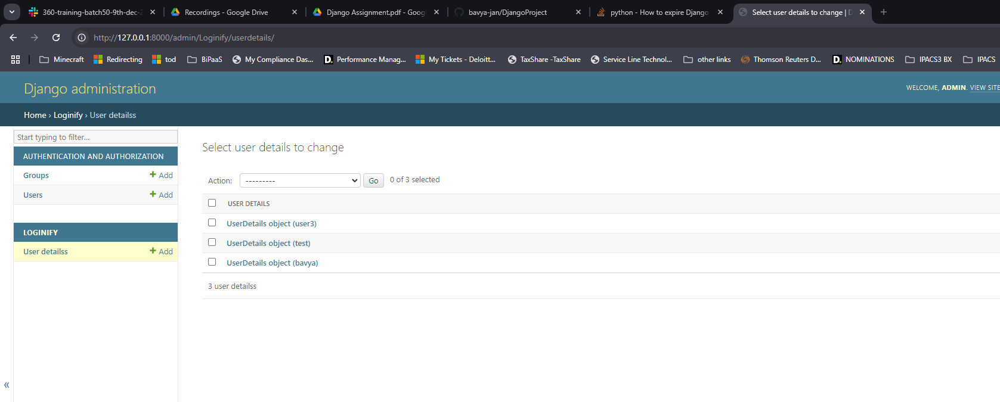

Here, I have ran all the shell commands mentioned in the document

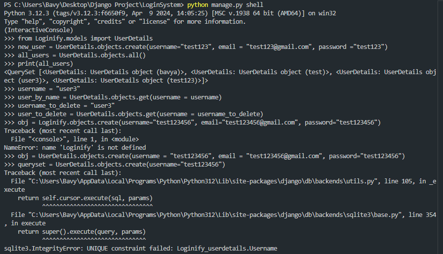

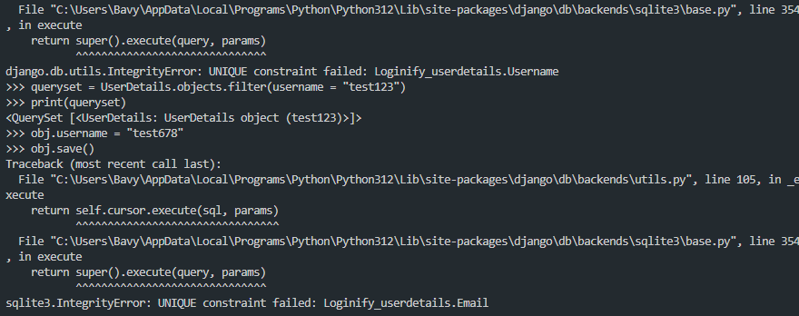

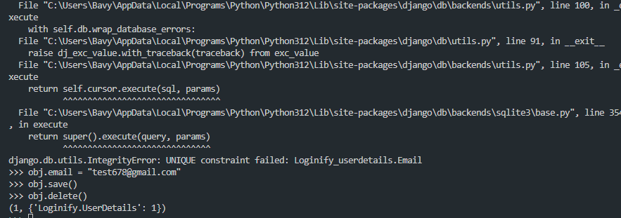

Task 5:

Getting all user details via postman:

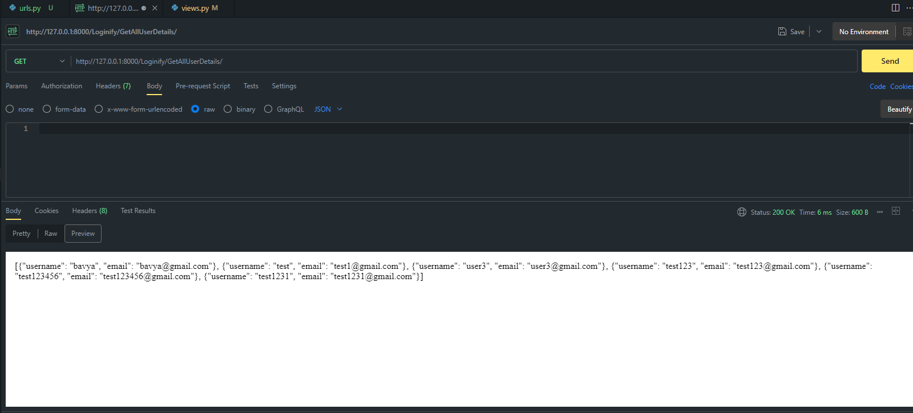

Getting single user based on username:

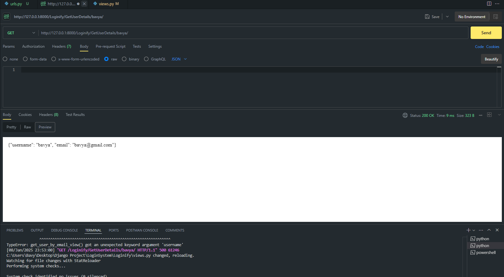

Updating user “bavya” email:

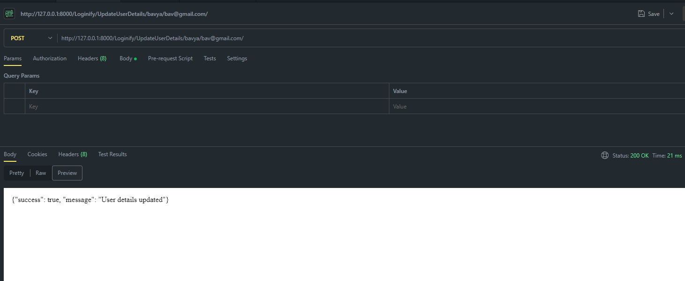

After updation:

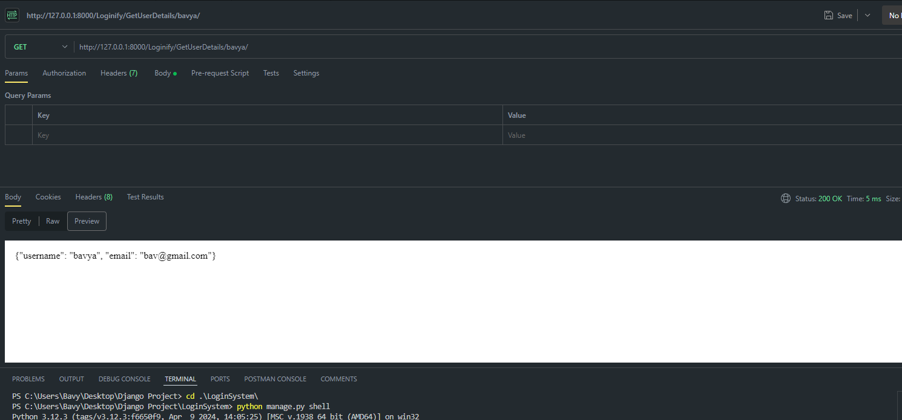

Deleting user “test1231”:

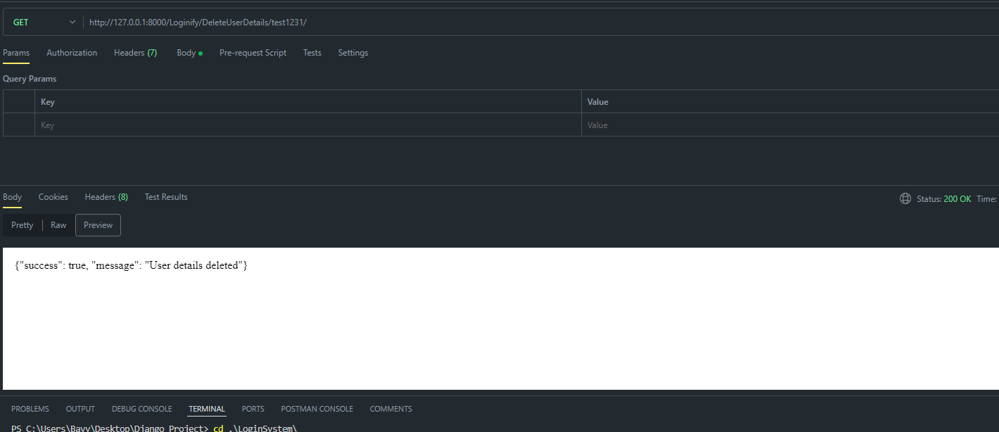

After deletion:

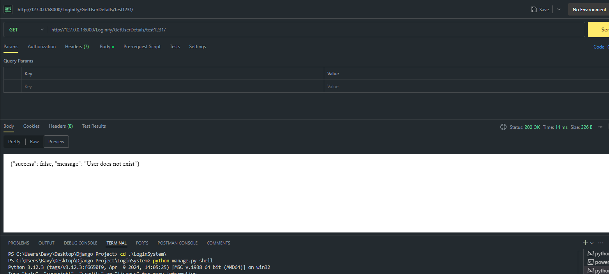